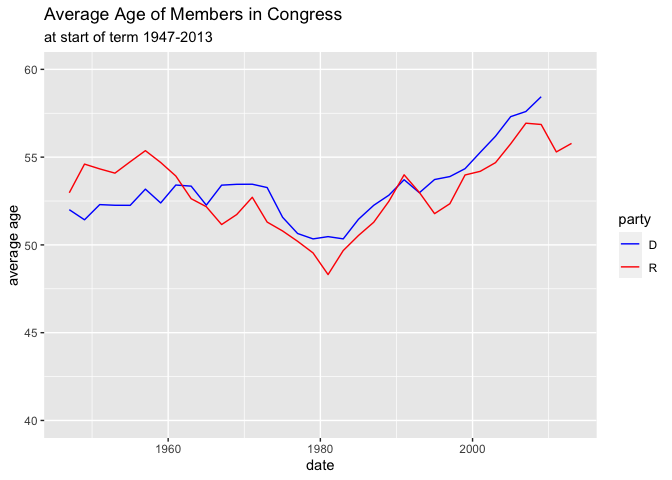

Average Age of Members in Congress
================

## GitHub Documents

This is an R Markdown format used for publishing markdown documents to
GitHub. When you click the **Knit** button all R code chunks are run and
a markdown file (.md) suitable for publishing to GitHub is generated.

## Including Code

You can include R code in the document as follows:

``` r
library(ggplot2)
library(dplyr)
```

    ## 
    ## Attaching package: 'dplyr'

    ## The following objects are masked from 'package:stats':
    ## 
    ##     filter, lag

    ## The following objects are masked from 'package:base':
    ## 
    ##     intersect, setdiff, setequal, union

``` r
library(fivethirtyeight)
```

    ## Some larger datasets need to be installed separately, like senators and
    ## house_district_forecast. To install these, we recommend you install the
    ## fivethirtyeightdata package by running:
    ## install.packages('fivethirtyeightdata', repos =
    ## 'https://fivethirtyeightdata.github.io/drat/', type = 'source')

``` r
avg_congress_age <- congress_age %>%
  select(termstart, party, age) %>%
  group_by(termstart, party) %>%
  summarize(mean_age = mean(age)) %>%
  filter(party == "R"| party == "D")
```

    ## `summarise()` has grouped output by 'termstart'. You can override using the `.groups` argument.

``` r
avg_congress_age <- avg_congress_age %>%
  mutate(mean_age_months =(mean_age*12))
```

## Including Plots

You can also embed plots, for example:

<!-- -->

Note that the `echo = FALSE` parameter was added to the code chunk to
prevent printing of the R code that generated the plot.
